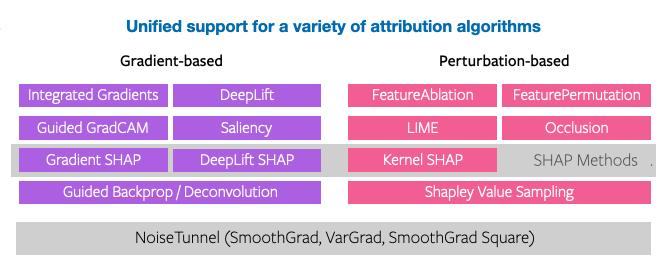
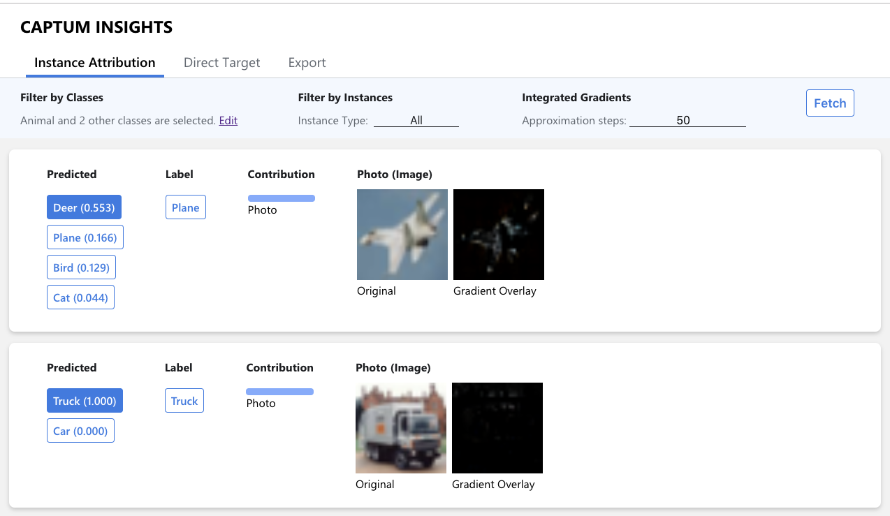

<hr/>

<!--- BADGES: START --->
[][#github-license]
[](https://anaconda.org/pytorch/captum)
[][#pypi-package]
[](https://circleci.com/gh/pytorch/captum)
[][#conda-forge-package]
[][#conda-forge-package]
[][#conda-forge-feedstock]
[][#docs-package]

[#github-license]: https://github.com/pytorch/captum/blob/master/LICENSE
[#pypi-package]: https://pypi.org/project/captum/
[#conda-forge-package]: https://anaconda.org/conda-forge/captum
[#conda-forge-feedstock]: https://github.com/conda-forge/captum-feedstock
[#docs-package]: https://captum.ai/
<!--- BADGES: END --->


Captum is a model interpretability and understanding library for PyTorch.
Captum means comprehension in Latin and contains general purpose implementations
of integrated gradients, saliency maps, smoothgrad, vargrad and others for
PyTorch models. It has quick integration for models built with domain-specific
libraries such as torchvision, torchtext, and others.

*Captum is currently in beta and under active development!*


#### About Captum

With the increase in model complexity and the resulting lack of transparency, model interpretability methods have become increasingly important. Model understanding is both an active area of research as well as an area of focus for practical applications across industries using machine learning. Captum provides state-of-the-art algorithms, including Integrated Gradients, to provide researchers and developers with an easy way to understand which features are contributing to a model’s output.

For model developers, Captum can be used to improve and troubleshoot models by facilitating the identification of different features that contribute to a model’s output in order to design better models and troubleshoot unexpected model outputs.

Captum helps ML researchers more easily implement interpretability algorithms that can interact with PyTorch models. Captum also allows researchers to quickly benchmark their work against other existing algorithms available in the library.



#### Target Audience

The primary audiences for Captum are model developers who are looking to improve their models and understand which features are important and interpretability researchers focused on identifying algorithms that can better interpret many types of models.

Captum can also be used by application engineers who are using trained models in production. Captum provides easier troubleshooting through improved model interpretability, and the potential for delivering better explanations to end users on why they’re seeing a specific piece of content, such as a movie recommendation.

## Installation

**Installation Requirements**
- Python >= 3.6
- PyTorch >= 1.2


##### Installing the latest release

The latest release of Captum is easily installed either via
[Anaconda](https://www.anaconda.com/distribution/#download-section) (recommended) or via `pip`.

**with `conda`**

You can install captum from any of the following supported conda channels:

- channel: `pytorch`

  ```sh
  conda install captum -c pytorch
  ```

- channel: `conda-forge`

  ```sh
  conda install captum -c conda-forge
  ```

**With `pip`**

```bash
pip install captum
```

**Manual / Dev install**

If you'd like to try our bleeding edge features (and don't mind potentially
running into the occasional bug here or there), you can install the latest
master directly from GitHub. For a basic install, run:
```bash
git clone https://github.com/pytorch/captum.git
cd captum
pip install -e .
```

To customize the installation, you can also run the following variants of the
above:
* `pip install -e .[insights]`: Also installs all packages necessary for running Captum Insights.
* `pip install -e .[dev]`: Also installs all tools necessary for development
  (testing, linting, docs building; see [Contributing](#contributing) below).
* `pip install -e .[tutorials]`: Also installs all packages necessary for running the tutorial notebooks.

To execute unit tests from a manual install, run:
```bash
# running a single unit test
python -m unittest -v tests.attr.test_saliency
# running all unit tests
pytest -ra
```

## Getting Started
Captum helps you interpret and understand predictions of PyTorch models by
exploring features that contribute to a prediction the model makes.
It also helps understand which neurons and layers are important for
model predictions.

Let's apply some of those algorithms to a toy model we have created for
demonstration purposes.
For simplicity, we will use the following architecture, but users are welcome
to use any PyTorch model of their choice.


```python
import numpy as np

import torch
import torch.nn as nn

from captum.attr import (
    GradientShap,
    DeepLift,
    DeepLiftShap,
    IntegratedGradients,
    LayerConductance,
    NeuronConductance,
    NoiseTunnel,
)

class ToyModel(nn.Module):
    def __init__(self):
        super().__init__()
        self.lin1 = nn.Linear(3, 3)
        self.relu = nn.ReLU()
        self.lin2 = nn.Linear(3, 2)

        # initialize weights and biases
        self.lin1.weight = nn.Parameter(torch.arange(-4.0, 5.0).view(3, 3))
        self.lin1.bias = nn.Parameter(torch.zeros(1,3))
        self.lin2.weight = nn.Parameter(torch.arange(-3.0, 3.0).view(2, 3))
        self.lin2.bias = nn.Parameter(torch.ones(1,2))

    def forward(self, input):
        return self.lin2(self.relu(self.lin1(input)))
```

Let's create an instance of our model and set it to eval mode.
```python
model = ToyModel()
model.eval()
```

Next, we need to define simple input and baseline tensors.
Baselines belong to the input space and often carry no predictive signal.
Zero tensor can serve as a baseline for many tasks.
Some interpretability algorithms such as `Integrated
Gradients`, `Deeplift` and `GradientShap` are designed to attribute the change
between the input and baseline to a predictive class or a value that the neural
network outputs.

We will apply model interpretability algorithms on the network
mentioned above in order to understand the importance of individual
neurons/layers and the parts of the input that play an important role in the
final prediction.

To make computations deterministic, let's fix random seeds.

```python
torch.manual_seed(123)
np.random.seed(123)
```

Let's define our input and baseline tensors. Baselines are used in some
interpretability algorithms such as `IntegratedGradients, DeepLift,
GradientShap, NeuronConductance, LayerConductance, InternalInfluence` and
`NeuronIntegratedGradients`.

```python
input = torch.rand(2, 3)
baseline = torch.zeros(2, 3)
```
Next we will use `IntegratedGradients` algorithms to assign attribution
scores to each input feature with respect to the first target output.
```python
ig = IntegratedGradients(model)
attributions, delta = ig.attribute(input, baseline, target=0, return_convergence_delta=True)
print('IG Attributions:', attributions)
print('Convergence Delta:', delta)
```
Output:
```
IG Attributions: tensor([[-0.5922, -1.5497, -1.0067],
                         [ 0.0000, -0.2219, -5.1991]])
Convergence Delta: tensor([2.3842e-07, -4.7684e-07])
```
The algorithm outputs an attribution score for each input element and a
convergence delta. The lower the absolute value of the convergence delta the better
is the approximation. If we choose not to return delta,
we can simply not provide the `return_convergence_delta` input
argument. The absolute value of the returned deltas can be interpreted as an
approximation error for each input sample.
It can also serve as a proxy of how accurate the integral approximation for given
inputs and baselines is.
If the approximation error is large, we can try a larger number of integral
approximation steps by setting `n_steps` to a larger value. Not all algorithms
return approximation error. Those which do, though, compute it based on the
completeness property of the algorithms.

Positive attribution score means that the input in that particular position
positively contributed to the final prediction and negative means the opposite.
The magnitude of the attribution score signifies the strength of the contribution.
Zero attribution score means no contribution from that particular feature.

Similarly, we can apply `GradientShap`, `DeepLift` and other attribution algorithms to the model.

`GradientShap` first chooses a random baseline from baselines' distribution, then
 adds gaussian noise with std=0.09 to each input example `n_samples` times.
Afterwards, it chooses a random point between each example-baseline pair and
computes the gradients with respect to target class (in this case target=0). Resulting
attribution is the mean of gradients * (inputs - baselines)
```python
gs = GradientShap(model)

# We define a distribution of baselines and draw `n_samples` from that
# distribution in order to estimate the expectations of gradients across all baselines
baseline_dist = torch.randn(10, 3) * 0.001
attributions, delta = gs.attribute(input, stdevs=0.09, n_samples=4, baselines=baseline_dist,
                                   target=0, return_convergence_delta=True)
print('GradientShap Attributions:', attributions)
print('Convergence Delta:', delta)
```
Output
```
GradientShap Attributions: tensor([[-0.1542, -1.6229, -1.5835],
                                   [-0.3916, -0.2836, -4.6851]])
Convergence Delta: tensor([ 0.0000, -0.0005, -0.0029, -0.0084, -0.0087, -0.0405,  0.0000, -0.0084])

```
Deltas are computed for each `n_samples * input.shape[0]` example. The user can,
for instance, average them:
```python
deltas_per_example = torch.mean(delta.reshape(input.shape[0], -1), dim=1)
```
in order to get per example average delta.


Below is an example of how we can apply `DeepLift` and `DeepLiftShap` on the
`ToyModel` described above. The current implementation of DeepLift supports only the
`Rescale` rule.
For more details on alternative implementations, please see the [DeepLift paper](https://arxiv.org/abs/1704.02685).

```python
dl = DeepLift(model)
attributions, delta = dl.attribute(input, baseline, target=0, return_convergence_delta=True)
print('DeepLift Attributions:', attributions)
print('Convergence Delta:', delta)
```
Output
```
DeepLift Attributions: tensor([[-0.5922, -1.5497, -1.0067],
                               [ 0.0000, -0.2219, -5.1991])
Convergence Delta: tensor([0., 0.])
```
`DeepLift` assigns similar attribution scores as `IntegratedGradients` to inputs,
however it has lower execution time. Another important thing to remember about
DeepLift is that it currently doesn't support all non-linear activation types.
For more details on limitations of the current implementation, please see the
[DeepLift paper](https://arxiv.org/abs/1704.02685).

Similar to integrated gradients, DeepLift returns a convergence delta score
per input example. The approximation error is then the absolute
value of the convergence deltas and can serve as a proxy of how accurate the
algorithm's approximation is.

Now let's look into `DeepLiftShap`. Similar to `GradientShap`, `DeepLiftShap` uses
baseline distribution. In the example below, we use the same baseline distribution
as for `GradientShap`.

```python
dl = DeepLiftShap(model)
attributions, delta = dl.attribute(input, baseline_dist, target=0, return_convergence_delta=True)
print('DeepLiftSHAP Attributions:', attributions)
print('Convergence Delta:', delta)
```
Output
```
DeepLiftShap Attributions: tensor([[-5.9169e-01, -1.5491e+00, -1.0076e+00],
                                   [-4.7101e-03, -2.2300e-01, -5.1926e+00]], grad_fn=<MeanBackward1>)
Convergence Delta: tensor([-4.6120e-03, -1.6267e-03, -5.1045e-04, -1.4184e-03, -6.8886e-03,
                           -2.2224e-02,  0.0000e+00, -2.8790e-02, -4.1285e-03, -2.7295e-02,
                           -3.2349e-03, -1.6265e-03, -4.7684e-07, -1.4191e-03, -6.8889e-03,
                           -2.2224e-02,  0.0000e+00, -2.4792e-02, -4.1289e-03, -2.7296e-02])
```
`DeepLiftShap` uses `DeepLift` to compute attribution score for each
input-baseline pair and averages it for each input across all baselines.

It computes deltas for each input example-baseline pair, thus resulting to
`input.shape[0] * baseline.shape[0]` delta values.

Similar to GradientShap in order to compute example-based deltas we can average them per example:
```python
deltas_per_example = torch.mean(delta.reshape(input.shape[0], -1), dim=1)
```
In order to smooth and improve the quality of the attributions we can run
`IntegratedGradients` and other attribution methods through a `NoiseTunnel`.
`NoiseTunnel` allows us to use `SmoothGrad`, `SmoothGrad_Sq` and `VarGrad` techniques
to smoothen the attributions by aggregating them for multiple noisy
samples that were generated by adding gaussian noise.

Here is an example of how we can use `NoiseTunnel` with `IntegratedGradients`.

```python
ig = IntegratedGradients(model)
nt = NoiseTunnel(ig)
attributions, delta = nt.attribute(input, nt_type='smoothgrad', stdevs=0.02, nt_samples=4,
      baselines=baseline, target=0, return_convergence_delta=True)
print('IG + SmoothGrad Attributions:', attributions)
print('Convergence Delta:', delta)
```
Output
```
IG + SmoothGrad Attributions: tensor([[-0.4574, -1.5493, -1.0893],
                                      [ 0.0000, -0.2647, -5.1619]])
Convergence Delta: tensor([ 0.0000e+00,  2.3842e-07,  0.0000e+00, -2.3842e-07,  0.0000e+00,
        -4.7684e-07,  0.0000e+00, -4.7684e-07])

```
The number of elements in the `delta` tensor is equal to: `nt_samples * input.shape[0]`
In order to get an example-wise delta, we can, for example, average them:
```python
deltas_per_example = torch.mean(delta.reshape(input.shape[0], -1), dim=1)
```

Let's look into the internals of our network and understand which layers
and neurons are important for the predictions.

We will start with the `NeuronConductance`. `NeuronConductance` helps us to identify
input features that are important for a particular neuron in a given
layer. It decomposes the computation of integrated gradients via the chain rule by
defining the importance of a neuron as path integral of the derivative of the output
with respect to the neuron times the derivatives of the neuron with respect to the
inputs of the model.

In this case, we choose to analyze the first neuron in the linear layer.

```python
nc = NeuronConductance(model, model.lin1)
attributions = nc.attribute(input, neuron_selector=1, target=0)
print('Neuron Attributions:', attributions)
```
Output
```
Neuron Attributions: tensor([[ 0.0000,  0.0000,  0.0000],
                             [ 1.3358,  0.0000, -1.6811]])
```

Layer conductance shows the importance of neurons for a layer and given input.
It is an extension of path integrated gradients for hidden layers and holds the
completeness property as well.

It doesn't attribute the contribution scores to the input features
but shows the importance of each neuron in the selected layer.
```python
lc = LayerConductance(model, model.lin1)
attributions, delta = lc.attribute(input, baselines=baseline, target=0, return_convergence_delta=True)
print('Layer Attributions:', attributions)
print('Convergence Delta:', delta)
```
Outputs
```
Layer Attributions: tensor([[ 0.0000,  0.0000, -3.0856],
                            [ 0.0000, -0.3488, -4.9638]], grad_fn=<SumBackward1>)
Convergence Delta: tensor([0.0630, 0.1084])
```

Similar to other attribution algorithms that return convergence delta, `LayerConductance`
returns the deltas for each example. The approximation error is then the absolute
value of the convergence deltas and can serve as a proxy of how accurate integral
approximation for given inputs and baselines is.

More details on the list of supported algorithms and how to apply
Captum on different types of models can be found in our tutorials.


## Captum Insights

Captum provides a web interface called Insights for easy visualization and
access to a number of our interpretability algorithms.

To analyze a sample model on CIFAR10 via Captum Insights run

```
python -m captum.insights.example
```

and navigate to the URL specified in the output.



To build Insights you will need [Node](https://nodejs.org/en/) >= 8.x
and [Yarn](https://yarnpkg.com/en/) >= 1.5.

To build and launch from a checkout in a conda environment run

```
conda install -c conda-forge yarn
BUILD_INSIGHTS=1 python setup.py develop
python captum/insights/example.py
```

### Captum Insights Jupyter Widget
Captum Insights also has a Jupyter widget providing the same user interface as the web app.
To install and enable the widget, run

```
jupyter nbextension install --py --symlink --sys-prefix captum.insights.attr_vis.widget
jupyter nbextension enable captum.insights.attr_vis.widget --py --sys-prefix
```

To build the widget from a checkout in a conda environment run

```
conda install -c conda-forge yarn
BUILD_INSIGHTS=1 python setup.py develop
```

## FAQ
If you have questions about using Captum methods, please check this [FAQ](docs/faq.md), which addresses many common issues.

## Contributing
See the [CONTRIBUTING](CONTRIBUTING.md) file for how to help out.

## Talks and Papers
**NeurIPS 2019:**
The slides of our presentation  can be found [here](docs/presentations/Captum_NeurIPS_2019_final.key)

**KDD 2020:**
The slides of our presentation from KDD 2020 tutorial can be found [here](https://pytorch-tutorial-assets.s3.amazonaws.com/Captum_KDD_2020.pdf).
You can watch the recorded talk [here](https://www.youtube.com/watch?v=hY_XzglTkak)

**GTC 2020:**
Opening Up the Black Box: Model Understanding with Captum and PyTorch.
You can watch the recorded talk [here](https://www.youtube.com/watch?v=0QLrRyLndFI)

**XAI Summit 2020:**
Using Captum and Fiddler to Improve Model Understanding with Explainable AI.
You can watch the recorded talk [here](https://www.youtube.com/watch?v=dvuVld5Hyc8)

**PyTorch Developer Day 2020**
Model Interpretability.
You can watch the recorded talk [here](https://www.youtube.com/watch?v=Lj5hHBGue58)

**NAACL 2021**
Tutorial on Fine-grained Interpretation and Causation Analysis in Deep NLP Models.
You can watch the recorded talk [here](https://www.youtube.com/watch?v=ayhBHZYjeqs
)

**ICLR 2021 workshop on Responsible AI**:
- [Paper](https://arxiv.org/abs/2009.07896) on the Captum Library
- [Paper](https://arxiv.org/abs/2106.07475) on Invesitgating Sanity Checks for Saliency Maps

## References of Algorithms

* `IntegratedGradients`, `LayerIntegratedGradients`: [Axiomatic Attribution for Deep Networks, Mukund Sundararajan et al. 2017](https://arxiv.org/abs/1703.01365) and [Did the Model Understand the Question?, Pramod K. Mudrakarta, et al. 2018](https://arxiv.org/abs/1805.05492)
* `InputXGradient`: [Not Just a Black Box: Learning Important Features Through Propagating Activation Differences, Avanti Shrikumar et al. 2016](https://arxiv.org/abs/1605.01713)
* `SmoothGrad`: [SmoothGrad: removing noise by adding noise, Daniel Smilkov et al. 2017](https://arxiv.org/abs/1706.03825)
* `NoiseTunnel`: [Sanity Checks for Saliency Maps, Julius Adebayo et al. 2018](https://arxiv.org/abs/1810.03292)
* `NeuronConductance`: [How Important is a neuron?, Kedar Dhamdhere et al. 2018](https://arxiv.org/abs/1805.12233)
* `LayerConductance`: [Computationally Efficient Measures of Internal Neuron Importance, Avanti Shrikumar et al. 2018](https://arxiv.org/pdf/1807.09946.pdf)
* `DeepLift`, `NeuronDeepLift`, `LayerDeepLift`: [Learning Important Features Through Propagating Activation Differences, Avanti Shrikumar et al. 2017](https://arxiv.org/pdf/1704.02685.pdf) and [Towards better understanding of gradient-based attribution methods for deep neural networks, Marco Ancona et al. 2018](https://openreview.net/pdf?id=Sy21R9JAW)
* `NeuronIntegratedGradients`: [Computationally Efficient Measures of Internal Neuron Importance, Avanti Shrikumar et al. 2018](https://arxiv.org/pdf/1807.09946.pdf)
* `GradientShap`, `NeuronGradientShap`, `LayerGradientShap`, `DeepLiftShap`, `NeuronDeepLiftShap`, `LayerDeepLiftShap`: [A Unified Approach to Interpreting Model Predictions, Scott M. Lundberg et al. 2017](http://papers.nips.cc/paper/7062-a-unified-approach-to-interpreting-model-predictions)
* `InternalInfluence`: [Influence-Directed Explanations for Deep Convolutional Networks, Klas Leino et al. 2018](https://arxiv.org/pdf/1802.03788.pdf)
* `Saliency`, `NeuronGradient`: [Deep Inside Convolutional Networks: Visualising
Image Classification Models and Saliency Maps, K. Simonyan, et. al. 2014](https://arxiv.org/pdf/1312.6034.pdf)
* `GradCAM`, `Guided GradCAM`: [Grad-CAM: Visual Explanations from Deep Networks via Gradient-based Localization, Ramprasaath R. Selvaraju et al. 2017](https://arxiv.org/abs/1610.02391.pdf)
* `Deconvolution`, `Neuron Deconvolution`: [Visualizing and Understanding Convolutional Networks, Matthew D Zeiler et al. 2014](https://arxiv.org/pdf/1311.2901.pdf)
* `Guided Backpropagation`, `Neuron Guided Backpropagation`: [Striving for Simplicity: The All Convolutional Net, Jost Tobias Springenberg et al. 2015](https://arxiv.org/pdf/1412.6806.pdf)
* `Feature Permutation`: [Permutation Feature Importance](https://christophm.github.io/interpretable-ml-book/feature-importance.html)
* `Occlusion`: [Visualizing and Understanding Convolutional Networks](https://arxiv.org/abs/1311.2901)
* `Shapley Value`: [A value for n-person games. Contributions to the Theory of Games 2.28 (1953): 307-317](https://apps.dtic.mil/dtic/tr/fulltext/u2/604084.pdf)
* `Shapley Value Sampling`: [Polynomial calculation of the Shapley value based on sampling](https://www.sciencedirect.com/science/article/pii/S0305054808000804)
* `Infidelity and Sensitivity`: [On the (In)fidelity and Sensitivity for Explanations](https://arxiv.org/abs/1901.09392)

More details about the above mentioned [algorithms](https://captum.ai/docs/algorithms) and their pros and cons can be found on our [web-site](https://captum.ai/docs/algorithms_comparison_matrix).

## License
Captum is BSD licensed, as found in the [LICENSE](LICENSE) file.
